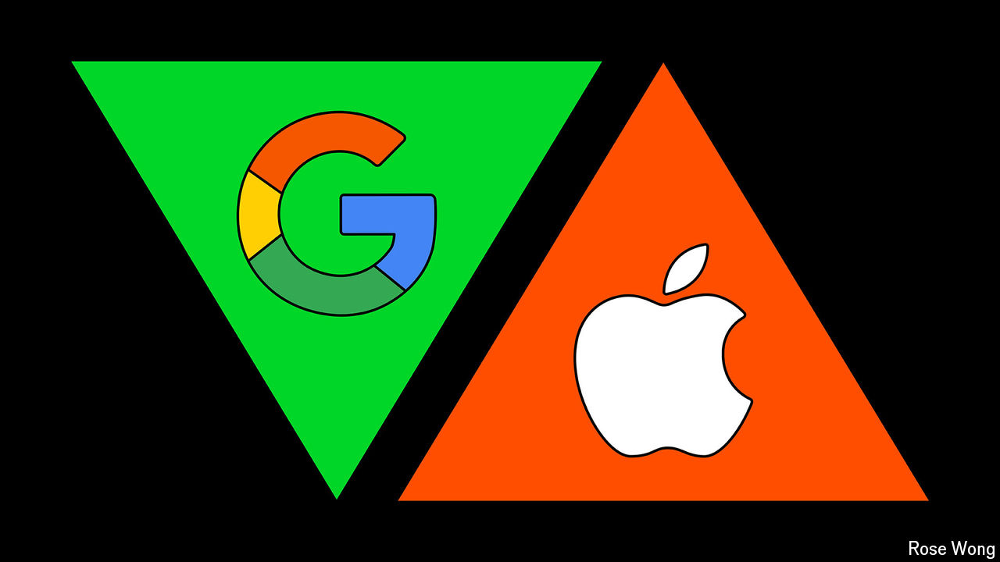

###### Pound of flesh

# Will America’s government try to break up Google? 

##### Antitrust remedies that target its generative-AI ambitions are more likely 

 

> Oct 3rd 2024 

For years shareholders have paid little heed to the thunderbolts hurled at America’s west-coast technology giants by the trustbusting deities of Washington, DC. No longer. Despite expectations of solidly rising profits, the share price of Alphabet, Google’s parent company, is wobbling (see chart). 

