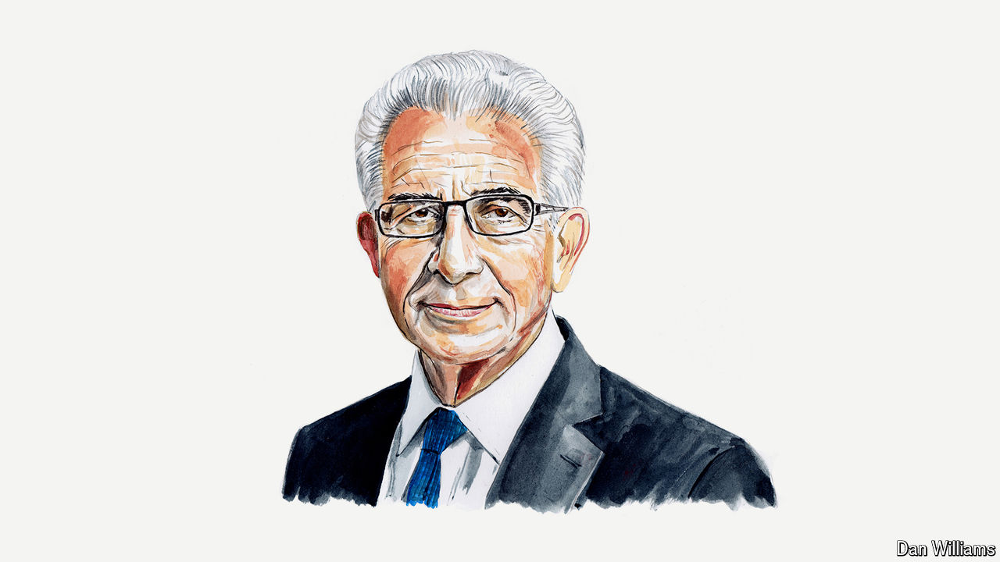

###### Mexico

# Ernesto Zedillo says AMLO has left Mexico on the verge of authoritarianism 

##### The former president exhorts Claudia Sheinbaum to opt for democracy 

 

> Sep 29th 2024 

FOR ALMOST seven decades of the 20th century,  was ruled by the Institutional Revolutionary Party, known as the PRI. For most of that period, the actions of the executive were neither monitored nor counterbalanced by Congress, which was assumed to support the executive unconditionally, nor by an independent judiciary, which was in effect subordinated to the president. 

