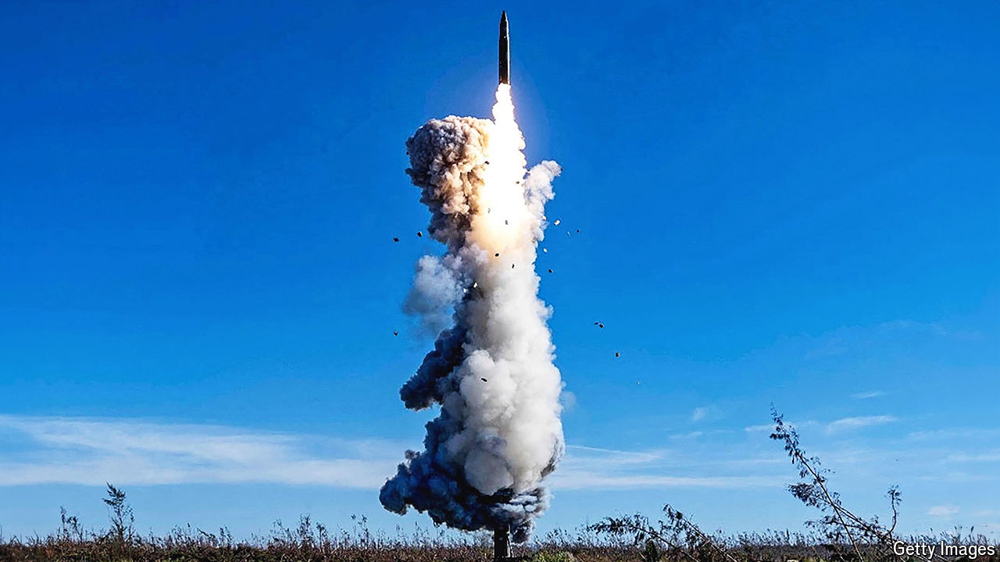

###### Making a sPLAsh

# A missile test by China marks its growing nuclear ambitions 

##### America worries that it is looking to surpass its own capabilities one day 

 

> Sep 27th 2024 

THE LAST time China fired an intercontinental ballistic missile (ICBM) out over the Pacific, Xi Jinping was 27 years old, China’s GDP per head was less than $200 and America had just lifted an arms embargo on the country. So the missile that rose from Hainan island on September 25th—carrying a dummy warhead and plunging into the waters around French Polynesia, some 12,000km to the east—was a mark of China’s soaring nuclear ambitions. 

