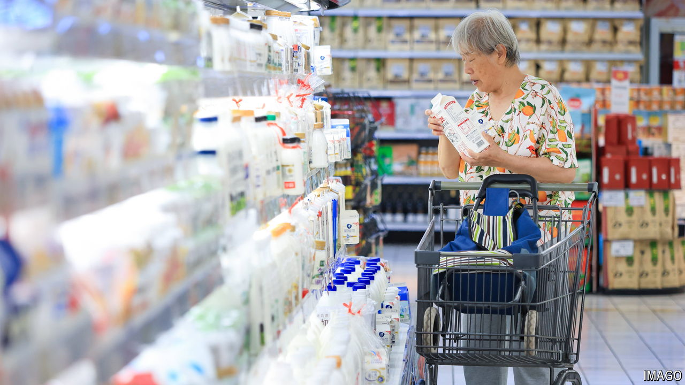

###### Udder pressure

# Why China is awash in unwanted milk 

##### Dairy farmers are dumping the stuff, as some call for culling cows 

 

> Oct 3rd 2024 

Milk is “indispensable for a healthy China and a strong nation”. So said officials in 2018 when they launched a campaign to supercharge the country’s dairy industry. They wanted to boost China’s food security by cutting its reliance on imported milk. At the same time, they hoped that the Chinese would become fitter by consuming more dairy products, which are rich in protein and calcium. Officials gave farmers subsidies to increase their herds of cows. They urged state propagandists to “nurture the habit of consuming dairy products”.

