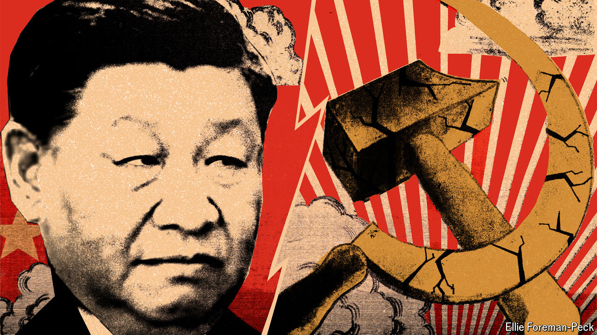

###### The fear of falling

# Worries of a Soviet-style collapse keep Xi Jinping up at night 

##### China’s Communists have now been in power longer than the Soviets 

 

> Sep 30th 2024 

IN LATE SEPTEMBER workers erected a new structure in Tiananmen Square. It is 18 metres tall, resembling a basket of fruit and flowers. Similar floral-themed displays have sprung up across Beijing in celebration of the 75th anniversary on October 1st of the founding of Communist China. This one bulges with giant peaches and gourds—symbols of long life. But China’s leader, Xi Jinping, worries about how long-lived his party’s rule will be.

