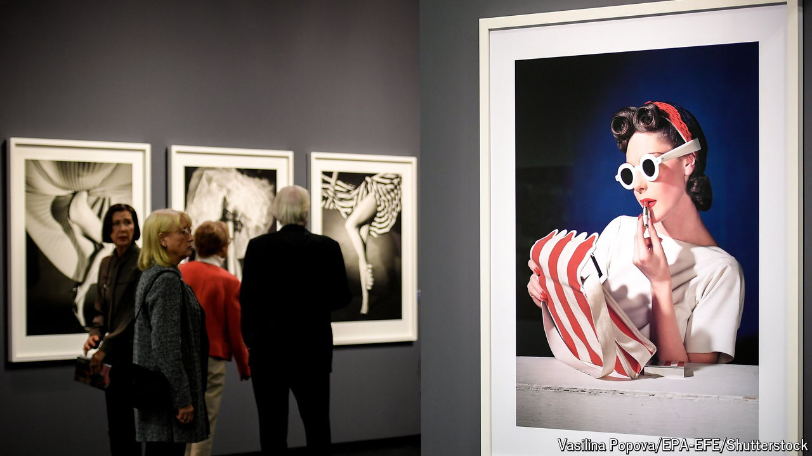

###### No passing fad

# Fashion photography is in vogue 

##### Museums and collectors now want what were once panned as commercial images for their walls 

 

> Oct 3rd 2024 

ELTON JOHN had just finished a stint in rehab. Without the fog induced by drink and drugs, he found he was able to look at the world with “clear eyes”. So when David Fahey, a gallerist, showed him work by three fashion photographers—Horst P. Horst, Irving Penn and Herb Ritts—the musician was transfixed. It marked the start of what would become one of the world’s largest private . More than 30 years later, Sir Elton has amassed more than 7,000 images.

