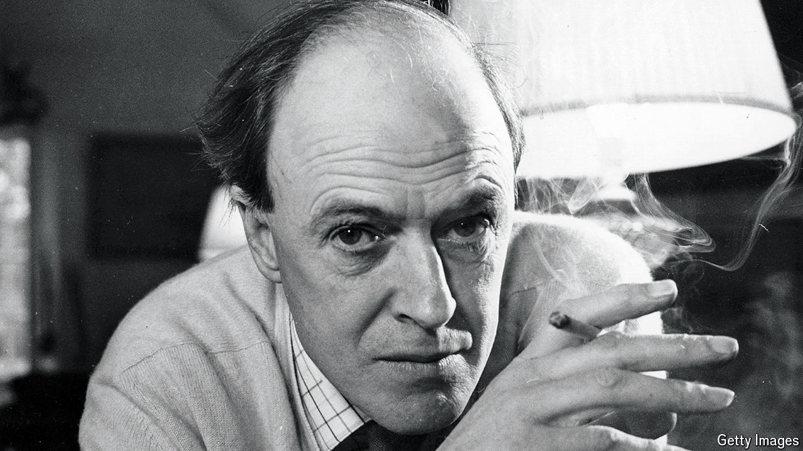

###### Back Story

# Roald Dahl was a genius—and a shocking bigot 

##### No magic potion or friendly giant can resolve this tension, as a new play shows 

 

> Oct 3rd 2024 

Perhaps, in the squeamish spirit of the times, the Royal Court Theatre in London should have put on two versions of “Giant”, a blistering new play about —one that quoted his bigoted remarks about Jews, the other omitting them for propriety. As it is, the show is an unblinking study of a great author’s prejudice and its bearing on his art. Unlike Dahl’s zany children’s stories, with their noble heroes and appalling villains, this one offers no easy morals.

