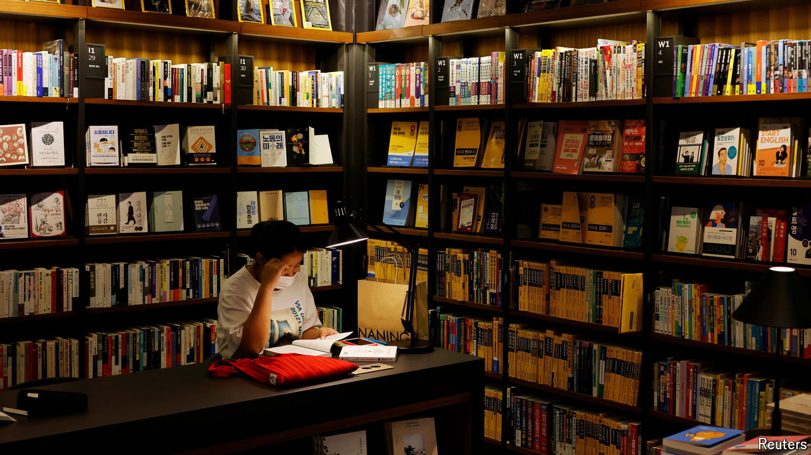

###### The next big thing

# Turn down the K-pop and pay attention to K-healing 

##### The rise of South Korean books about burnout has taken the world by storm 

 

> Oct 3rd 2024 

The country that gave the world popular bands such as  and hits such as and  is now exporting something slower-paced. The publication of “Marigold Mind Laundry” in America and Britain this month brings attention to the latest South Korean trend: the healing novel.

