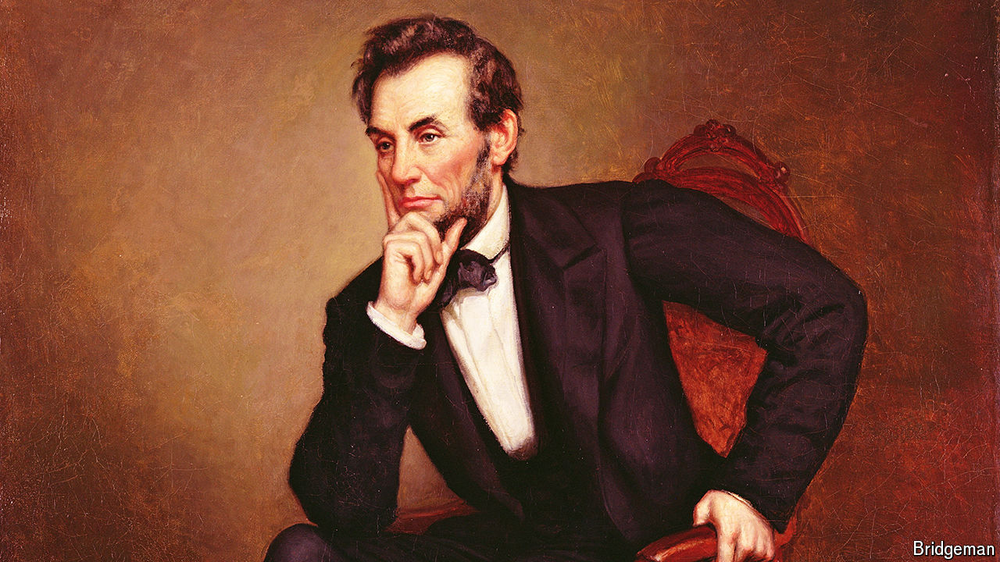

###### Revisiting history

# Was Abraham Lincoln gay? 

##### A controversial documentary re-examines the president’s relationships with men 

 

> Oct 1st 2024 

DURING America’s civil war, in 1862,  reportedly began sharing a bed with his bodyguard, a soldier named David Derickson. The tittle-tattle was recorded in the diary of Virginia Woodbury Fox, the wife of Lincoln’s naval aide, who wrote about “a soldier here devoted to the president, drives with him, and when Mrs. L. is not home, sleeps with him”. She added: “What stuff!”

