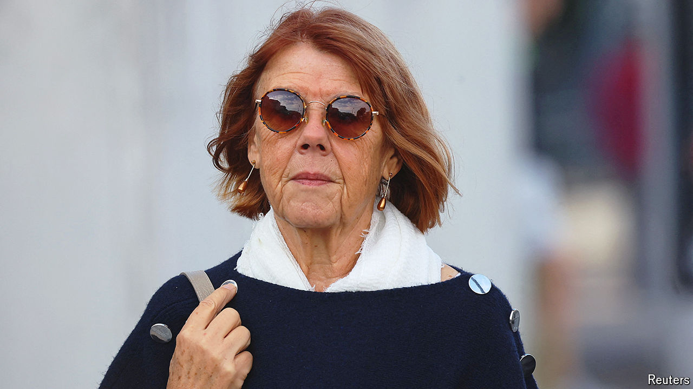

###### Sexual violence

# A harrowing rape trial in France has revived debate about consent 

##### Anything less than yes is no 

 

> Oct 3rd 2024 

For five weeks a harrowing rape trial taking place in a courtroom in the southern town of Avignon has shaken France. Dominique Pelicot, a retired 71-year-old, stands accused of drugging his then wife, Gisèle, raping her, inviting dozens of other men recruited online to rape her too while she was unconscious, and of filming them, all over a period of nine years. The trial, due to run until December, has opened French eyes to the horror of chemical submission and to what appears to be a disturbing misunderstanding of what constitutes rape, as well as to the remarkable courage and dignity of a woman who decided to make her ordeal public. French law on rape may now be changed as a result.

