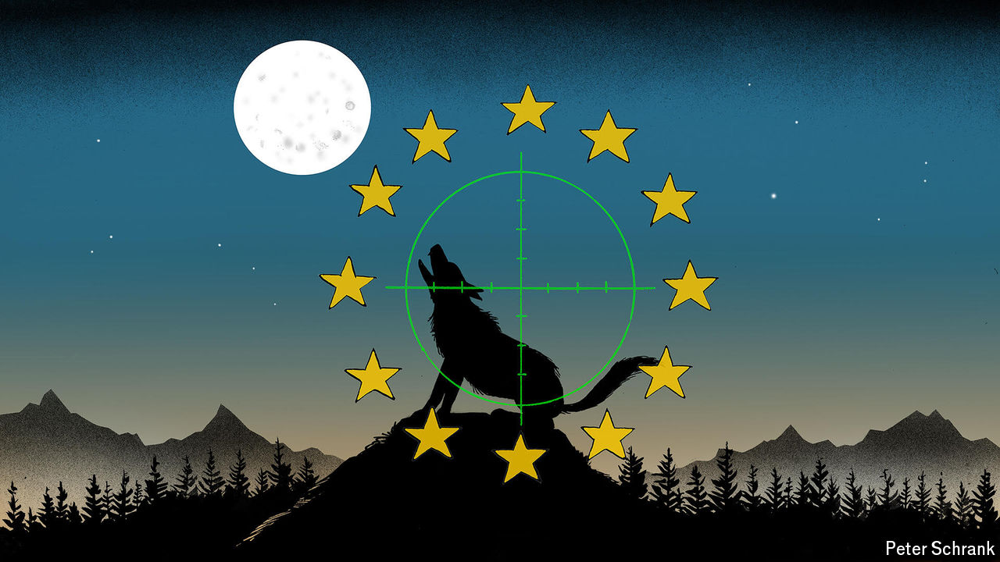

###### Charlemagne

# How the wolf went from folktale villain to culture-war scapegoat 

##### The startling return of wolves in Europe raises hackles 

 

> Oct 3rd 2024 

For centuries an ancestral fear has haunted the bedtime stories and the ensuing dreams of Europe’s children: the wolf. A devourer of youngsters wandering in folktale forests, the stealthy carnivore once loomed large in the public imagination. Modernity put paid to the dread peddled by the Brothers Grimm. By the early 20th century wolves had all but disappeared from Europe, driven to extinction by poaching and loss of habitat. But in recent decades a remarkable resurgence has been lauded by green campaigners as a form of ecological atonement: the first step to reversing centuries of man-made environmental carnage. Rural types, more likely to hear lupine howls in the dead of night and to find mutilated livestock and pets come morning, are less enthused. The wolf is now dividing Europeans, rather than eating them, as they argue over whether humans should once again share their cramped peninsula with a rival predator. 

