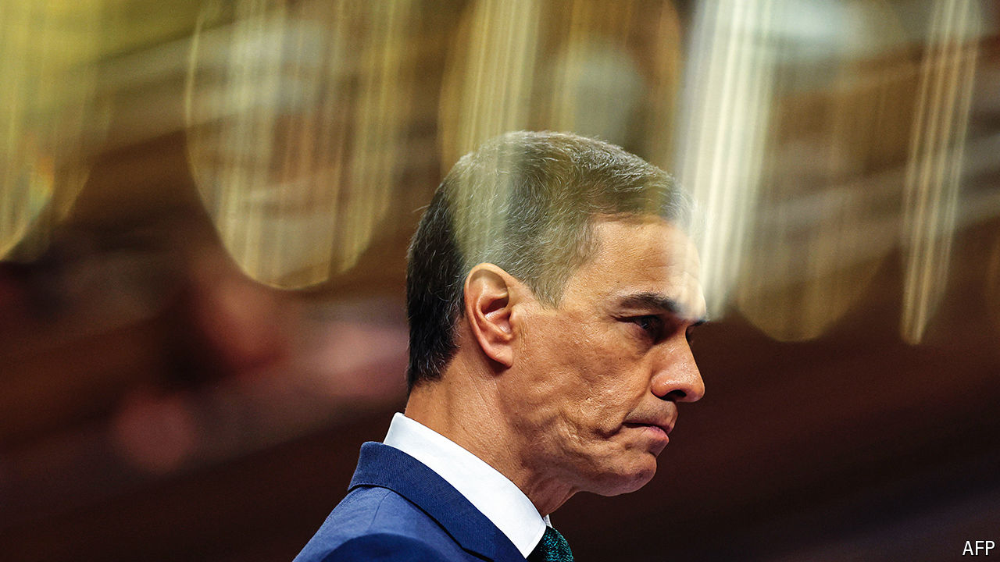

###### Not wholly in power

# Pedro Sánchez clings to office at a cost to Spain’s democracy 

##### His opponents accuse him of subverting the constitution 

 

> Oct 3rd 2024 

“We will move forward determinedly…with or without the help of the legislature,” Pedro Sánchez, Spain’s prime minister, told a meeting of his Socialist Party earlier last month. To his more excitable critics, this sounded like a declaration of dictatorship. In fact, it was a recognition of his embattled circumstances. In office since 2018, Mr Sánchez is the great survivor of European politics, a wily and ruthless tactician. But his minority coalition government rules at the pleasure of Catalan and Basque radical nationalists, and at a growing cost to the quality of Spain’s democracy and its institutions.

