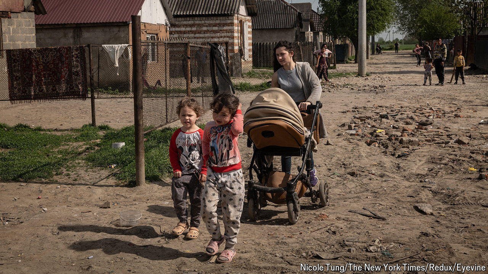

###### Hoping for better

# Ukraine’s Roma have suffered worse than most in the war 

##### Half of them may have fled 

 

> Oct 3rd 2024 

The war in Ukraine has shattered its Roma community. At least half of its pre-war population has fled abroad. That is a vastly higher proportion of refugees than among Ukrainians at large. Eleonora Kulchar, the director of a Roma refugee shelter in Uzhhorod in the country’s west, says that many have gone “for a new and better life, because they were discriminated against here and poor”. Few expect them ever to return. Many of them lack passports or identity cards, so may never be able to, because they cannot prove they are Ukrainian citizens. 

