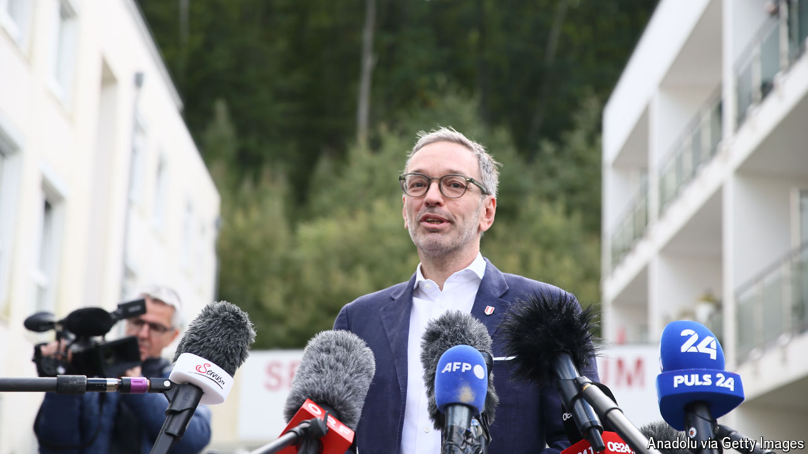

###### Austria’s election

# Why the hard-right Herbert Kickl is unlikely to be Austria’s next chancellor 

##### In spite of his strong win 

 

> Sep 29th 2024 

USUALLY, COMING top in a general election would make you a popular person in your capital. But Vienna was different this week. Despite  win by a solid margin, with 29% of the votes on September 29th, no other political party wants to run the country with him and his  (FPÖ). The governing centre-right People’s Party (ÖVP) came second with 26%, and is trying to avoid exactly that.

