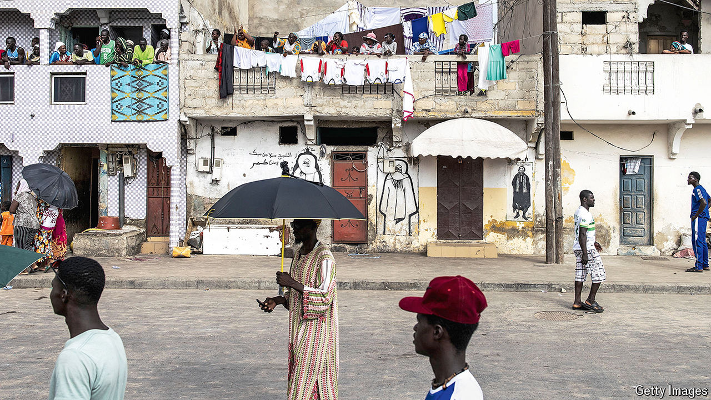

###### Unaccountable accounts

# A tonne of public debt is never made public 

##### New research suggests governments routinely hide their borrowing 

 

> Oct 3rd 2024 

How much money has Senegal borrowed? More than previously thought, according to Ousmane Sonko, who became its prime minister in April. At a press conference on September 26th he said the previous government had “lied to the people” by hiding loans worth 10% of GDP, enough to push the country’s public debt to 83% of national income. Since a full audit has not yet been published, it is hard to know what numbers to believe. The IMF, which has a $1.9bn bail-out programme with Senegal, is not pleased. 

