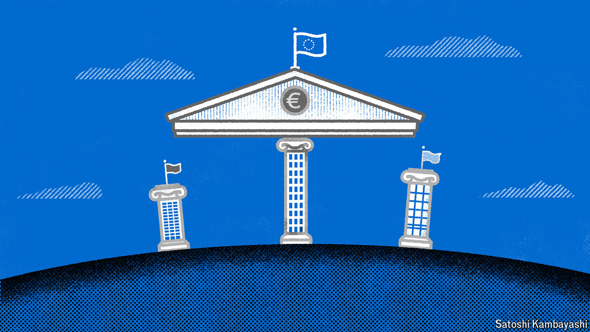

###### Buttonwood

# Can Andrea Orcel, Europe’s star banker, create a super-bank? 

##### An interview with the boss of UniCredit 

 

> Oct 3rd 2024 

The career of Andrea Orcel vividly encapsulates the recent history of European banking. At Merrill Lynch, now part of Bank of America, Mr Orcel advised on deals that formed part of the wave of mergers that crested in 2007, when a pan-European troika bought ABN AMRO, a Dutch lender. After the financial crisis of 2007-09, grand cross-border ambitions were ditched. Mr Orcel’s next job was to run the investment-banking arm of UBS, a Swiss champion. 

