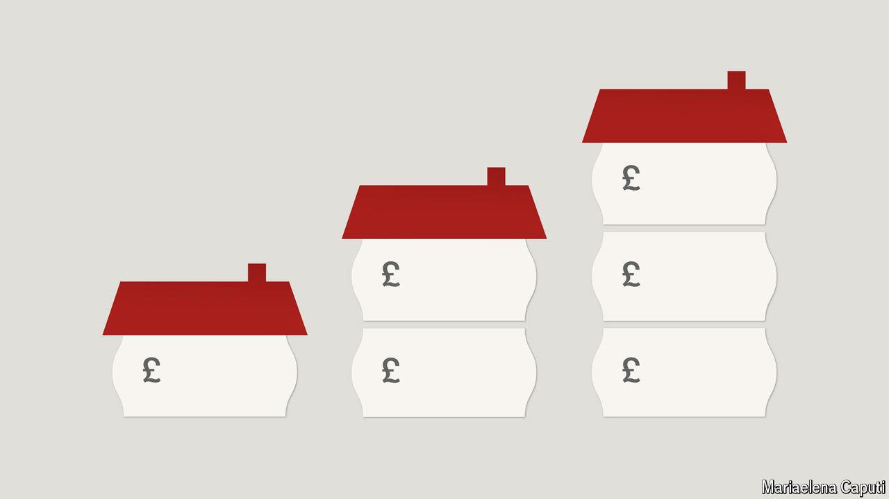

###### Block party

# The house-price supercycle is just getting going 

##### Why property prices could keep rising for years 

 

> Oct 1st 2024 

After THE financial crisis of 2007-09, global house prices fell by 6% in real terms. But, before long, they picked up again, and sailed past their pre-crisis peak. When covid-19 struck, economists reckoned a property crash was on the way. In fact there was a boom, with mask-wearing house-hunters fighting over desirable nests. And then from 2021 onwards, as central banks raised interest rates to defeat inflation, fears mounted of a house-price horror show. In fact, real prices fell by just 5.6%—and now they are rising fast again.  seems to have a remarkable ability to keep appreciating, whatever the weather. It will probably defy gravity even more insolently in the coming years. 

