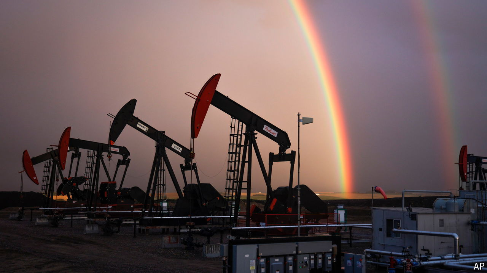

###### Economic decoupling

# Why is Canada’s economy falling behind America’s? 

##### The country was slightly richer than Montana in 2019. Now it is just poorer than Alabama 

 

> Sep 30th 2024 

The economies  of Canada and America are joined at the hip. Some $2bn of trade and 400,000 people cross their 9,000km of shared border every day. Canadians on the west coast do more day trips to nearby Seattle than to distant Toronto. No wonder the two economies have largely moved in lockstep in recent decades: between 2009 and 2019 America’s GDP grew by 27%; Canada’s expanded by 25%.

