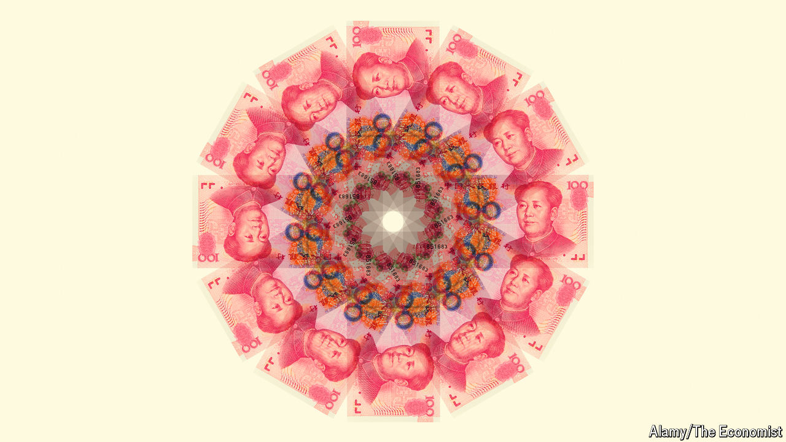

###### Good-vibes rally

# Xi Jinping’s belated stimulus has reset the mood in Chinese markets 

##### But can the buying frenzy last? 

 

> Oct 2nd 2024 

If Chinese retail investors had their way they would forgo the seven-day National Day holiday that ends on October 7th. An , announced in Beijing on September 24th, has unleashed the biggest weekly stockmarket rally the country has witnessed in more than 15 years. Major indices have soared more than 25%; the Shanghai stock exchange has suffered glitches under the volume of buying activity. The prospect of halting for a full week has made netizens anxious: “We must keep trading; we must cancel National Day,” one young investor screamed into a video widely shared on WeChat, a social-media platform.

