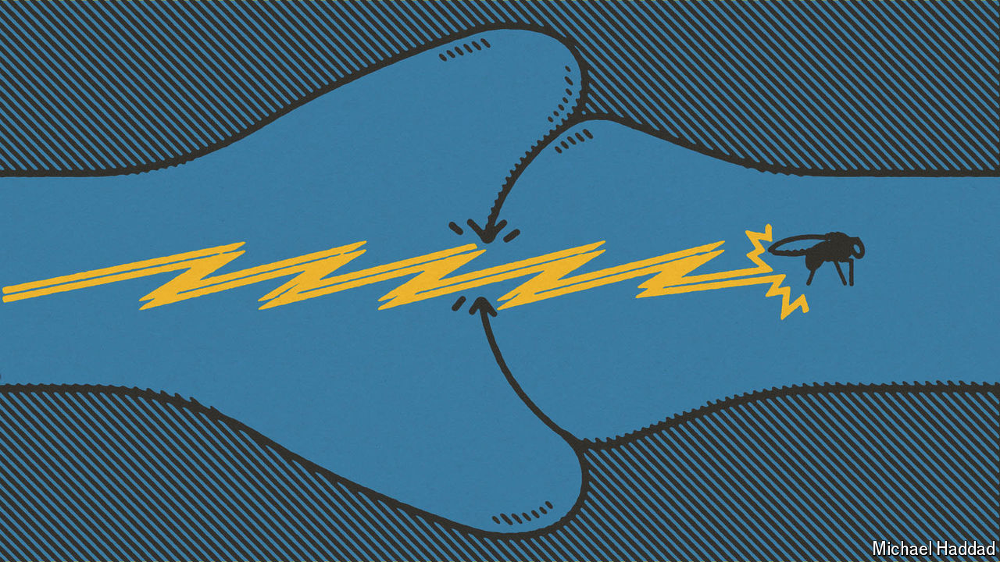

###### Know a fly, know thyself?

# A map of a fruit fly’s brain could help us understand our own 

##### A miracle of complexity, powered by rotting fruit 

 

> Oct 3rd 2024 

FOR BILLIONS of years, life was single-celled and boring. Even when it became multicellular and more interesting, it took the evolution of brains, and subsequent competition between them via the animal bodies they inhabited, to create the biodiversity that exists today. Greater complexity caused by brain-on-brain competition permitted better processing of information from special organs for vision, hearing, smell, taste and touch. This made for more cunning predators, more elusive prey and more demanding sexual partners. It also (because much physiology is regulated by the brain) allowed larger and more sophisticated bodies to evolve. 

