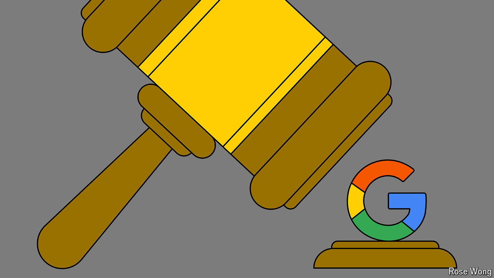

###### Shake up, not break up

# Dismantling Google is a terrible idea 

##### Despite its appeal as a political rallying cry 

 

> Oct 3rd 2024 

The parallels draw themselves. In 1999 America’s government prevailed in a high-profile antitrust suit against a tech giant it alleged was abusing a monopoly. The case then turned on the “power of the default” in internet browsers: Uncle Sam said Microsoft was forcing computer-makers to distribute its browser along with its Windows software. It resulted in proposals to break Microsoft up (though the firm won on appeal and remained whole).

