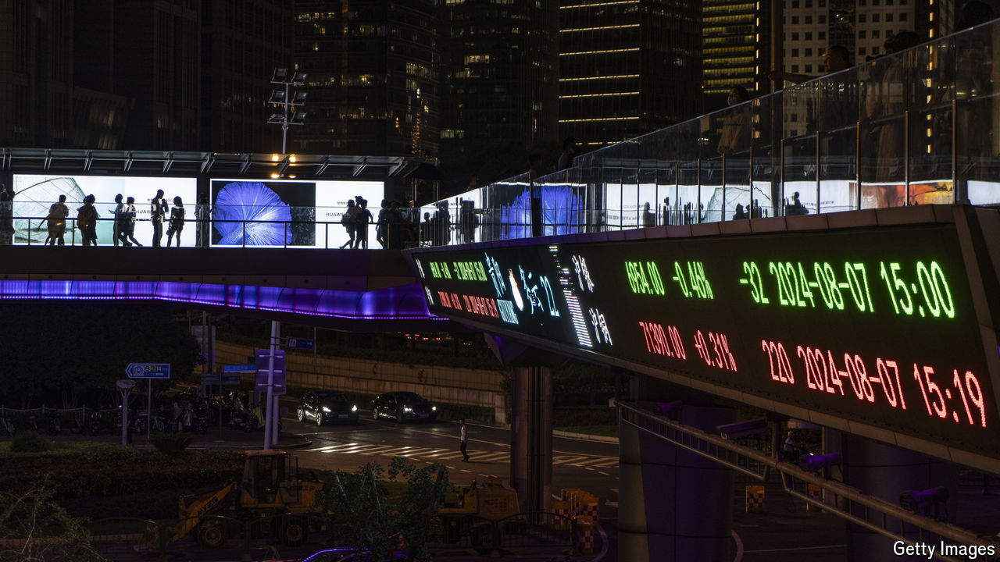

###### Too soon to party

# Don’t celebrate China’s stimulus just yet 

##### It will take more than a spectacular stockmarket rally to revive the economy 

 

> Oct 3rd 2024 

China’s policymakers have blinked at last. For 18 months, even as deflation set in and economic sentiment curdled, stimulus was half-hearted and piecemeal. Then last week came a belated turnaround. Officials unleashed a range of easing measures, suggesting that their pain threshold had been reached. 

