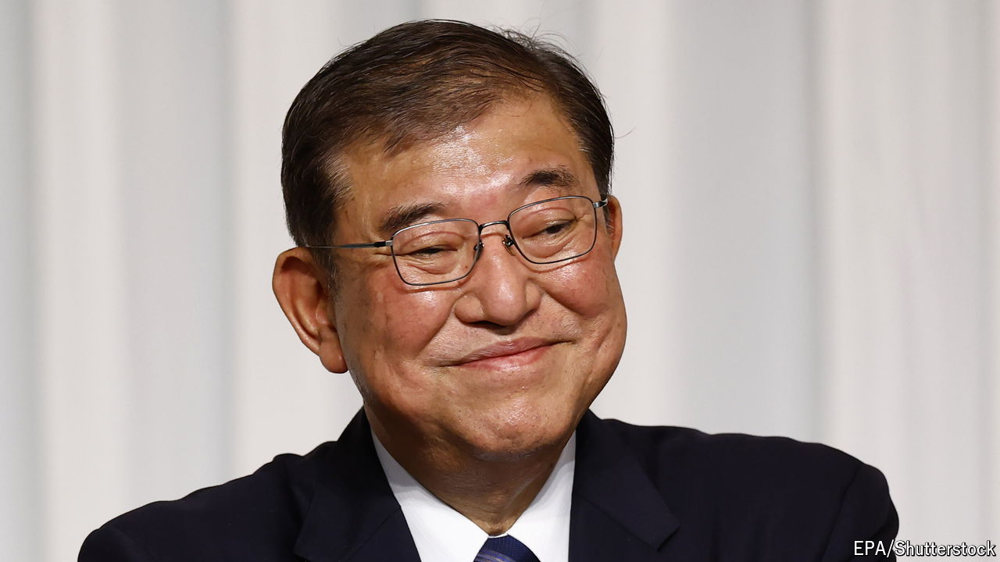

###### Ishiba Shigeru, gadfly-turned-leader

# Socially liberal and strong on defence, Japan’s new premier shows promise 

##### But he must ditch his more eccentric ideas if he is to control his party 

 

> Oct 3rd 2024 

In a turbulent world, Japan is a quiet force for stability. Yet its domestic politics is stormy. Frequent scandals have undermined trust in the ruling Liberal Democratic Party (LDP) and recently led to the resignation of Kishida Fumio as prime minister. The LDP has now made an unexpected choice to steady the ship in his wake: Ishiba Shigeru, a popular gadfly who has long been an outsider and lost his previous four bids for the party presidency. To succeed, he will have to learn to lead, rather than .

