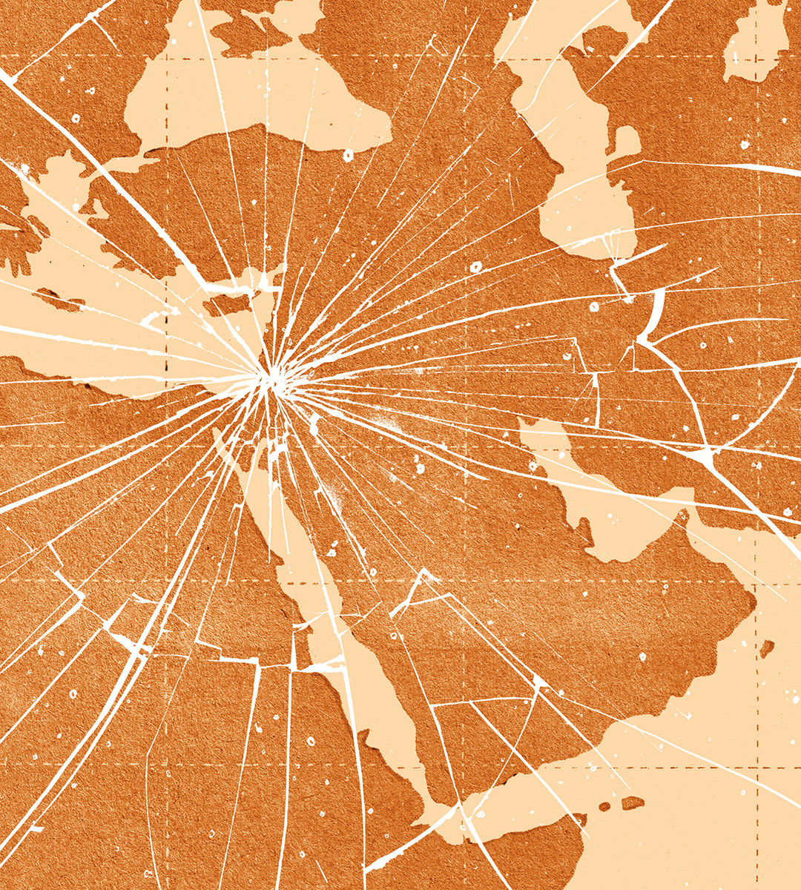

###### Iran, Israel and the Palestinians

# The year that shattered the Middle East 

##### Kill or be killed is the region’s new logic. Deterrence and diplomacy would be better 

 

> Oct 3rd 2024 

Ever since Hamas’s slaughter of Israelis on October 7th 2023, violence has been spreading. One year on, the Middle East is an inch away from an all-out war between Israel and Iran. Israel’s skilful decapitation of Hizbullah, a Lebanese militia backed by Iran, prompted the Islamic Republic to rain missiles on Israel on October 1st. Israel may retaliate, perhaps striking Iran’s industrial, military or nuclear facilities, hoping to end once and for all the threat it poses to the Jewish state. 

