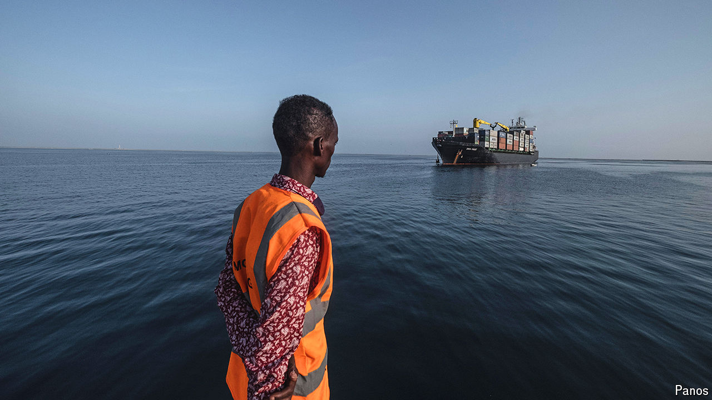

###### Looking for trouble

# A dangerous dispute in the Horn of Africa 

##### Ethiopia and Somalia are courting escalation in a quarrel over port access 

 

> Oct 3rd 2024 

Few parts of the world are more turbulent than the Horn of Africa, the continent’s north-eastern chunk that contains Somalia, Djibouti, Ethiopia and Eritrea. It has been racked by war between Ethiopia and Eritrea, by civil war in Ethiopia, and by war and state collapse due to a prolonged jihadist insurgency in Somalia. Outside powers, particularly those from across the water in the Gulf, vie for the Horn’s loyalties and resources. 

