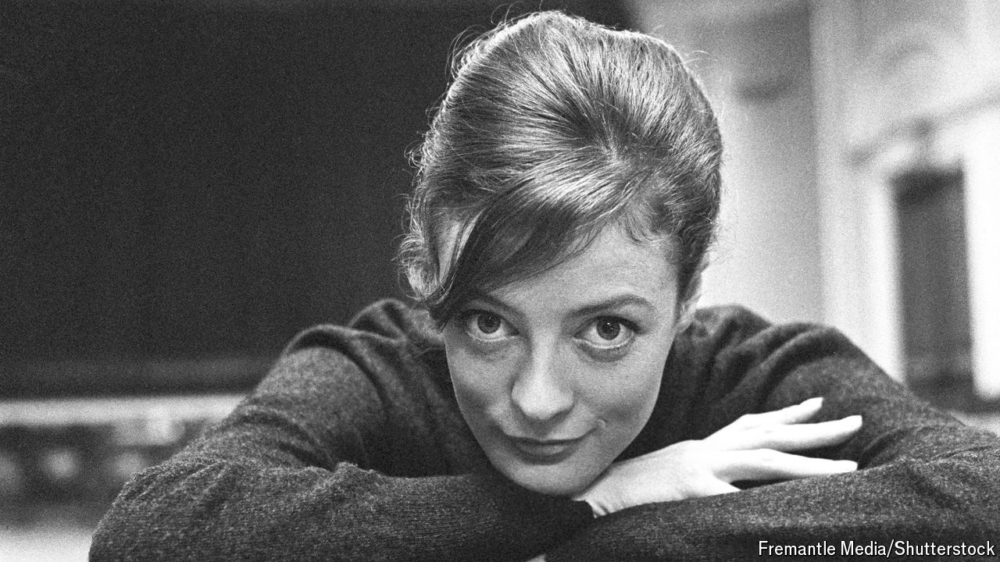

###### Obituary

# Maggie Smith, the dowager countess of comic timing 

##### She could transform herself into anyone, hilariously 

 

> Sep 27th 2024 

BY THE time she was in “Downton Abbey”, the television series in which she played the waspish Dowager Countess of Grantham, Maggie Smith was 75 years old and had won every acting prize you could name. And yet, she told an interviewer, “I’d led a perfectly normal life…Nobody knew who the hell I was.”

