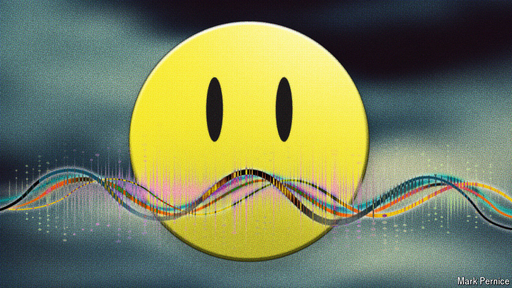

###### Sound of mind

# AI offers an intriguing new way to diagnose mental-health conditions 

##### Models look for sound patterns undetectable by the human ear 

 

> Oct 2nd 2024 

Traditional methods of diagnosing mental-health conditions require patients to speak directly to a psychiatrist. Sensible in theory, such assessments can, in practice, take months to schedule and ultimately lead to subjective diagnoses.

