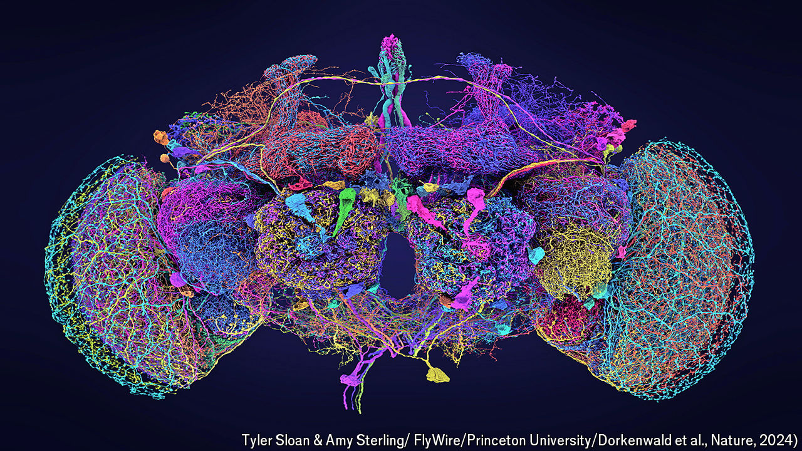

###### On the fly

# An adult fruit fly brain has been mapped—human brains could follow 

##### For now, it is the most sophisticated connectome ever made 

 

> Oct 2nd 2024 

FRUIT FLIES are smart. For a start—the clue is in the name—they can fly. They can also flirt; fight; form complex, long-term memories of their surroundings; and even warn one another about the presence of unseen dangers, such as parasitic wasps. 

