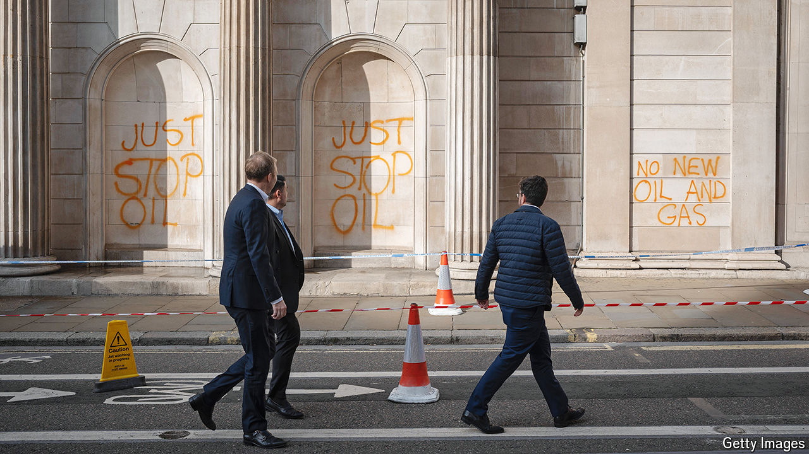

###### So much hot air

# Why it’s so hard to tell which climate policies actually work 

##### Better tools are needed to analyse their effects 

 

> Oct 2nd 2024 

NATIONAL CLIMATE policies are a relatively recent invention. In 1997, according to the Grantham Institute, a think-tank at the London School of Economics, there were 60; by 2022 the number had risen to almost 3,000. Their effectiveness has proved almost impossible to measure. In August, an international research group published the first global evaluation of climate policies in , a journal. The study, which looked at around 1,500 policies implemented in 41 countries between 1998 and 2022, found that just 63 could be linked to sizeable reductions in emissions. 

