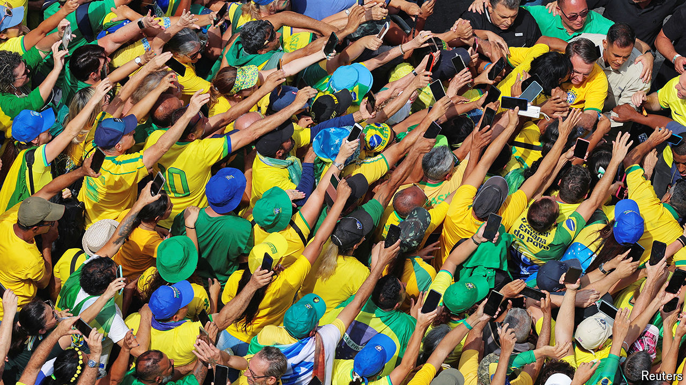

###### A long shadow

# Jair Bolsonaro still shapes Brazil’s political right 

##### Would-be successors are pandering to his fans 

 

> Oct 2nd 2024 

ON OCTOBER 6TH voters across Brazil will go to the polls to select more than 5,500 mayors and tens of thousands of city councillors (second-round run-offs will follow at the end of the month). The gigantic municipal vote provides a barometer of sorts for the next presidential election, which is due in 2026. Signs in the run-up are unsettling. Two years after Brazilians booted out Jair Bolsonaro, their inept and dangerous former president, right-wing politics remains in his thrall. An acolyte—or perhaps an imitator—could return  to power.

