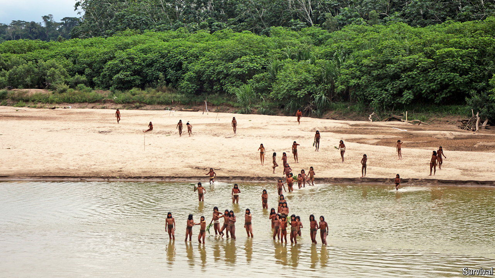

###### World’s end

# Peruvians are debating how to protect isolated tribes 

##### Deaths in the Amazon are bringing matters to a head 

 

> Oct 3rd 2024 

Jerson del Aguila was working for a logging company in the Peruvian rainforest when he came across a family of naked tribespeople. It was the first of two occasions in 2021 on which he would meet people from the Mashco Piro, an isolated indigenous group. He and his co-workers turned back and told a manager. But when his brother, Gean Marcos, was working in the same timber concession a year later, things turned out differently. Gean Marcos was shot with two arrows and killed.

