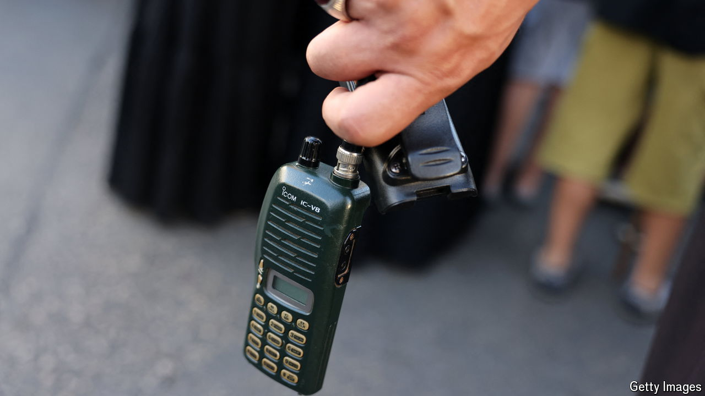

###### The Economist reads

# Books that probe the secrets of the Mossad 

##### Seven books on Israeli intelligence agencies, which are spearheading the offensive against Hizbullah in Lebanon 

 

> Sep 30th 2024 

FEW COUNTRIES take as much pride in their intelligence services as Israel. Led by the Mossad, founded in 1949, they have been at the  of Israel’s near-continuous battles against both terrorist groups and hostile states. The Mossad in particular, the equivalent of America’s CIA or Britain’s MI6, has acquired a reputation for audacity, inventiveness and ruthlessness.  and walkie-talkies of members of Hizbullah, an Iran-backed militia in Lebanon, has the hallmarks of a Mossad operation. Similarly, the Mossad will probably have been deeply involved in tracking the whereabouts of Hassan Nasrallah, the leader of Hizbullah, who was killed in an Israeli strike in Beirut on September 27th. These operations will have gone some way towards restoring the intelligence services’ reputations after their failure to forewarn of Hamas’s bloody raid from Gaza on October 7th 2023. Nearly a year later, before the latest attacks on Hizbullah’s leadership, Yossi Sariel, the head of Unit 8200, the signals-intelligence agency, became the latest intelligence chief to take responsibility for that failure and resign. 

