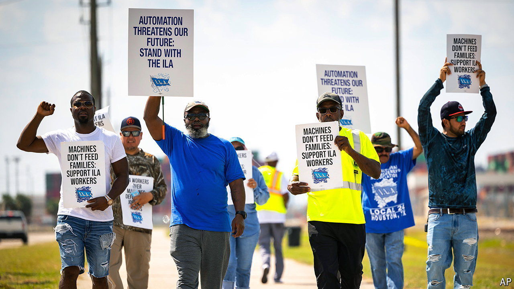

###### The world this week

# Business 

#####  

 

> Oct 3rd 2024 

 on America’s east and Gulf coasts went on strike, their first since 1977. Some of the ports affected are the busiest in the country, and include New York and New Jersey, Savannah and Houston. The workers’ union has rejected a pay rise of 50% over six years. With just a month to the election, the White House pressed employers to raise their offer, as businesses demanded that federal law is invoked to keep the ports open. A long strike will snarl up shipping and push up freight rates. Analysts at JPMorgan Chase estimate that it could cost the economy between $3.8bn and $4.5bn a day.

