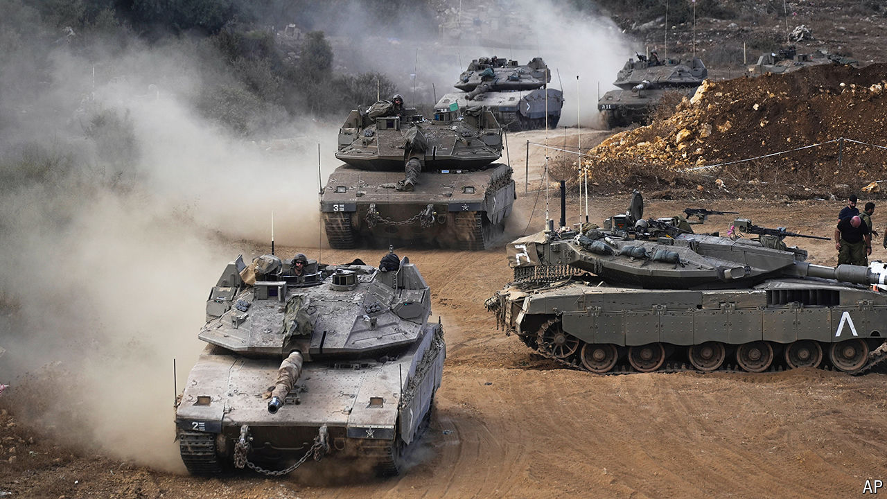

###### The world this week

# Politics 

#####  

 

> Oct 3rd 2024 

 launched a ground invasion of southern , initially sending small numbers of troops over the border but then preparing to deploy additional forces. They were soon engaged in heavy fighting with Hizbullah,  biggest proxy militia in the region, in which Israeli troops were killed. More than 1,000 Lebanese combatants and civilians have been killed and over 1m displaced. Iran lashed out with a direct attack on Israel, firing around 200 ballistic missiles. A man was killed in the West Bank when a missile fragment fell on him. No other deaths were reported. Binyamin Netanyahu, Israel’s prime minister, said Iran would pay a “heavy price”. 

