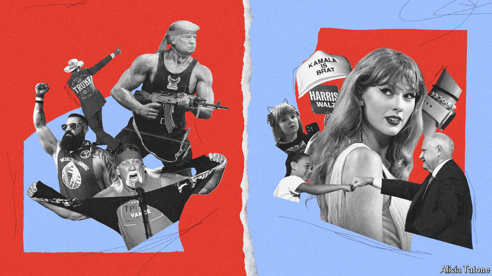

###### Voting and victimhood

# Crypto bros v cat ladies: gender and the 2024 election 

##### How the campaigns are exploiting and reshaping the battle of the sexes 

 

> Oct 3rd 2024 

In a brewery in Pittsburgh’s East End, six guys lounged on barstools talk about brawls and about women. “We can’t stand by, we’ve got to get in the fight,” says one. Another adds that as a husband it is natural to “go into defence mode” when his wife is under attack. The others nod vigorously. “The government should not be in the business of putting their hands on women’s wombs,” he concludes, to loud applause—and some spilled beer—at the tables around them.

