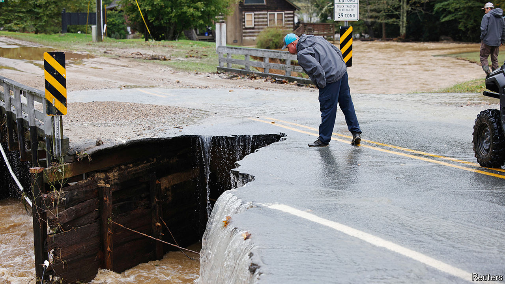

###### Washed away

# Hurricane Helene was America’s deadliest storm in nearly two decades 

##### It wiped out North Carolina’s mountain towns 

 

> Oct 3rd 2024 

When Hurricane HELENE hit Florida’s Big Bend on September 26th it was hard to imagine that it would wreak the most devastation over 400 miles north in the Appalachian mountains. Officials report that flooding across the Southeast has killed about 200 people, more than any mainland tropical storm since Hurricane Katrina in 2005. In North Carolina’s Buncombe County alone, home to the city of Asheville, at least 35 residents have died and 600 are missing. One woman who climbed to the roof of her house as the waters rose watched her seven-year-old son get swept away. Mules are delivering food to stranded survivors since roads were ravaged. 

