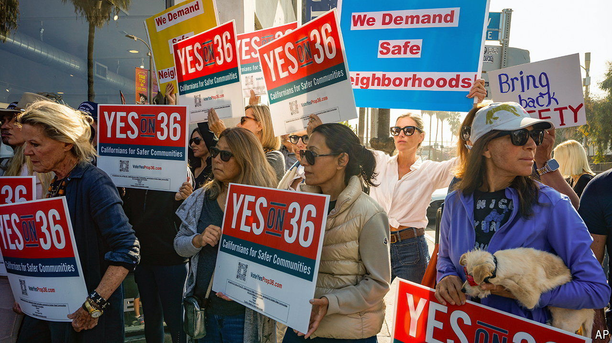

###### Taking the initiative

# Many Americans can decide their own policies. What will they choose? 

##### Three issues will dominate state ballot measures in November 

 

> Oct 3rd 2024 

“I WANT YOU to pick a sport to award $1m to,” Sondra Cosgrove tells her audience. Ms Cosgrove, a community-college professor, is trying to teach Nevadans how ranked-choice voting (RCV) works. The five sports with the most votes in the first poll (the primary) advance. In the second poll (the general election) basketball wins more than 50% of votes in the first round, eliminating the need for a run-off. If no sport had won more than half of the votes, the last-place finisher would be eliminated and their votes reallocated based on how participants ranked them. This process would repeat until a clear winner emerged. 

