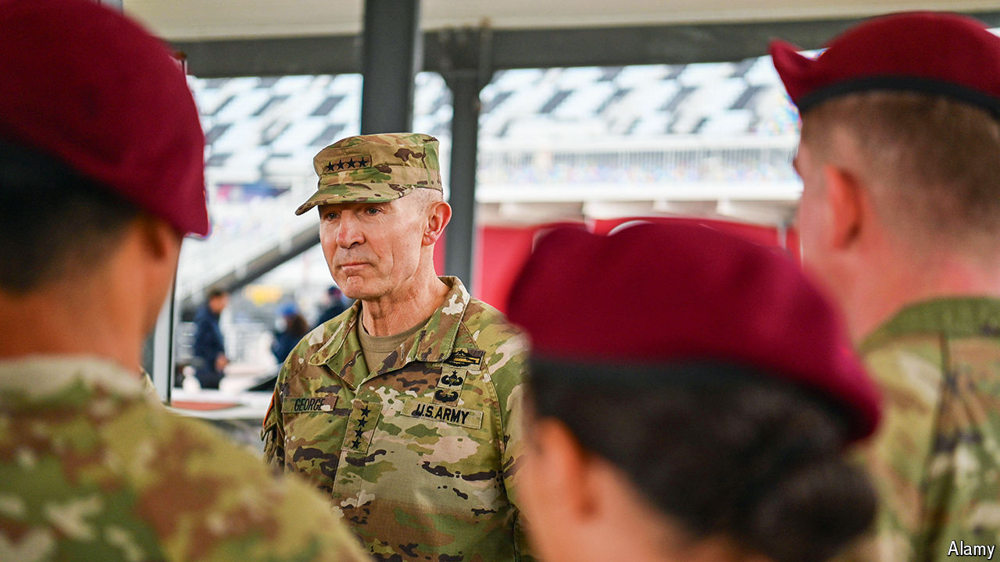

###### Reinventing the army

# The US Army’s chief of staff has ideas on the force of the future 

##### But can he scale up his clever experiments? 

 

> Sep 29th 2024 

RANDY GEORGE joined the US Army in 1988. It had overhauled itself after the trauma of . It had written a new doctrine, known as AirLand Battle, to defeat the Soviet Union in a war in Europe. And a few years later it would smash the Iraqi army in the first Gulf war, a conflict in which General George, as he is today, served as a young lieutenant. He is now in charge of that same , and wants to reinvent it, continuously, for a new age. 

