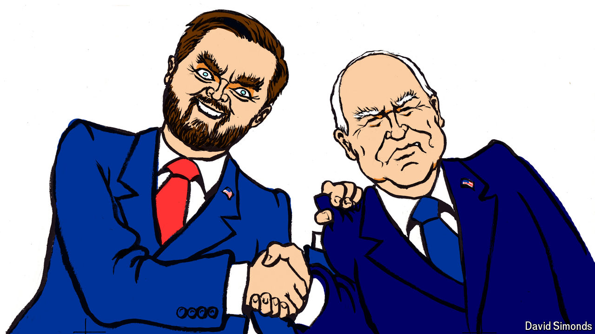

###### Lexington

# The vice-presidential debate was surprisingly cordial 

##### Its high-minded tone worked to J.D. Vance’s advantage 

 

> Oct 2nd 2024 

Why did  have to go and spoil things? For almost the entire vice-presidential debate on October 1st Americans were transported back to a different era in their politics, a time when candidates tried to seem—maybe even were—respectful of each other, open to compromise, mindful of their own weaknesses and intent on solving big problems. It was soothing, at times even informative, a bit dull in a good way. No one bragged about the size of their crowds, much less of their genitalia, or even called anyone else by a demeaning nickname. 

