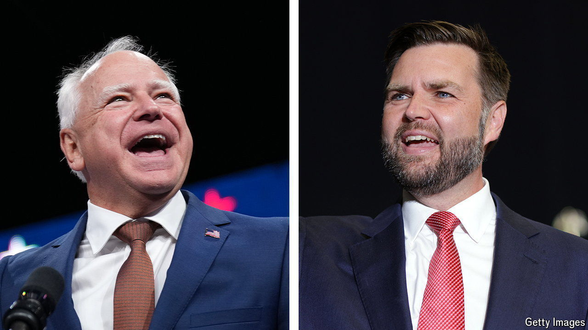

###### Running mate

# Tim Walz is the most popular candidate on either ticket 

##### How much difference does that make? 

 

> Oct 1st 2024 

Former president Donald Trump made an unusual foray into political science in July, arguing that “historically, the vice-president, in terms of the election, does not have any impact.” At the time, his running mate  was stumbling through a gaffe-filled rollout, having been drafted two weeks earlier. It seemed as if Mr Trump’s academic pronouncement was only intended to comfort himself—but it may have some merit. The vice-presidential debate did little to refute him (see Lexington).

