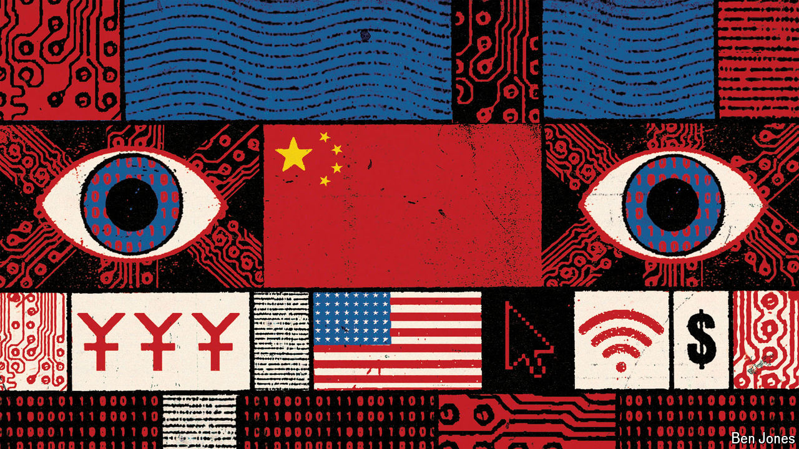

###### Digital domination

# America v China: who controls Asia’s internet? 

##### Amid an explosive data and AI boom the superpower contest hots up 

 

> Oct 8th 2024 

Nusajaya Tech Park looks like any other construction project. Cranes and building materials sit scattered around this industrial site in Johor, Malaysia, just 15km from the border with Singapore. But appearances are deceptive. Nusajaya is at the heart of an enormous data-centre boom that is taking place in one of the world’s fastest-growing regions. From here you can see the digital war between America and China unfold before your eyes. For America the view isn’t pretty. Even as it builds up its military presence in Asia, it risks falling behind in the digital contest.

