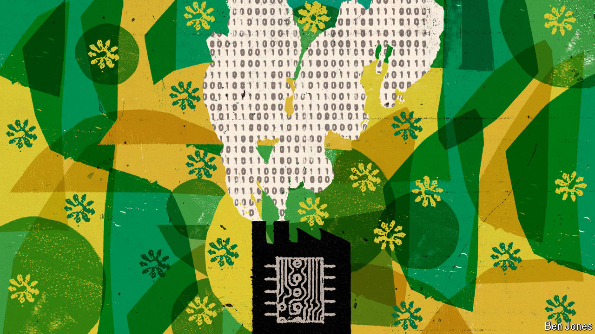

###### A glitch in the matrix

# Asia is weighing data-centre ambitions against sustainability 

##### Malaysia and Singapore illustrate the region’s resource balancing act 

 

> Oct 10th 2024 

The jungles of Johor, a Malaysian state, were cleared to grow pepper in the 1800s. After that came rubber and oil-palm plantations, followed by factories making electronics. Today data centres are thriving there, and are embroiled in a  between America and China. But in Johor, other concerns are on people’s minds: how to make the data-centre boom sustainable.

