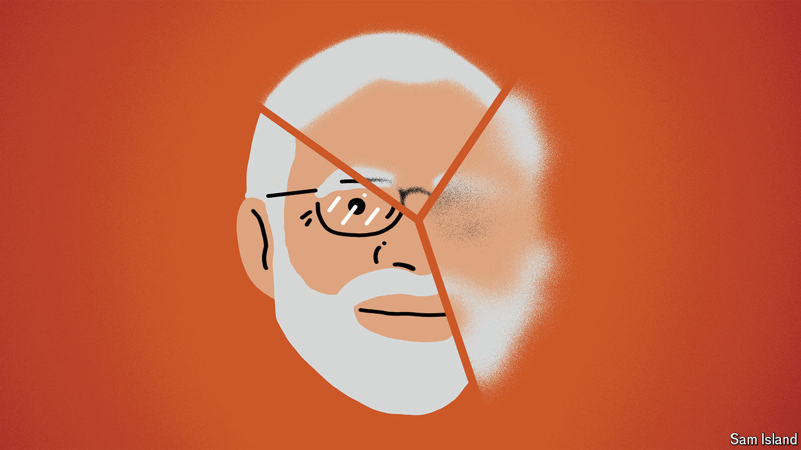

###### Banyan

# Has Narendra Modi lost his mojo? 

##### Two state elections suggest that India’s prime minister is no longer such a vote-winner 

 

> Oct 10th 2024 

Pity India’s pollsters. They have never been much good at predicting election results. In June, they suffered a humiliating setback when India’s ruling Bharatiya Janata Party (BJP) unexpectedly lost its majority in a general election. Pradeep Gupta, the head of Axis My India agency, was so upset that he burst into tears on live television. 

