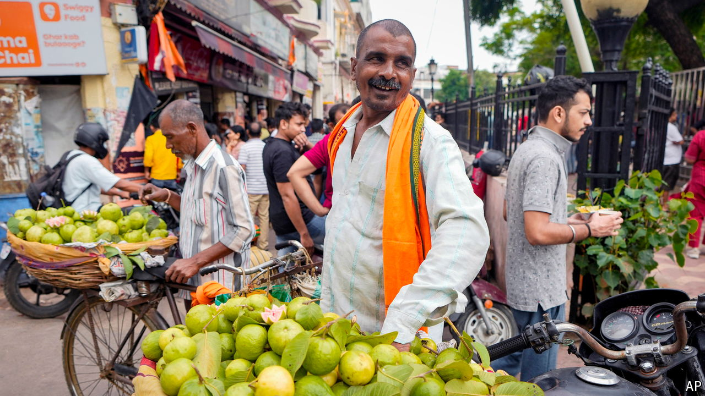

###### A quieter tiger?

# Is India’s economy slowing down? 

##### New data highlight old problems 

 

> Oct 10th 2024 

Speaking at a conference on India’s economy this week, Narendra Modi, the prime minister, was typically bullish about his country’s prospects. The world, he suggested, is living through an “Indian era”. Rapid growth, favourable demography and an emerging tech industry have put the country at a “sweet spot”, he said. 

