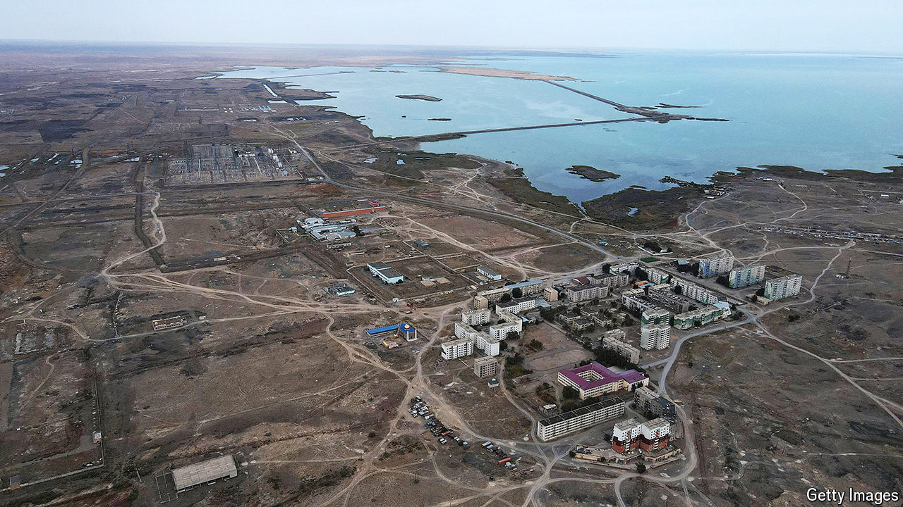

###### Going nuclear

# Kazakhstan’s referendum on nuclear energy could benefit Russia 

##### The opposition have been barred from campaigning or locked up 

 

> Oct 10th 2024 

“Vote for a nuclear power station!” So said the slogan plastered on billboards as Kazakhstan voted on October 6th in a referendum on whether to embrace atomic energy. The government went all out to win a “yes” vote, despite the country having a devastating history as a Soviet testing ground for nuclear bombs. Officials argued that building an atomic power station is vital to ensure Kazakhstan’s energy security and reduce reliance on fossil fuels to meet net-zero targets in 2060. Nuclear energy, they pointed out, is cleaner than the coal-fired plants that currently generate 70% of power in Kazakhstan, which is the world’s largest uranium producer.

