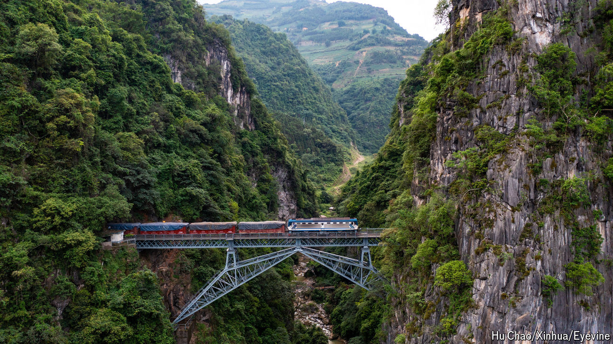

###### Doing the locomotion

# New railways could transform South-East Asia 

##### China is keen to assist 

 

> Oct 10th 2024 

Few better ways exist to see Vietnam than to travel on its north-south railway. It was originally built by French colonialists, and its trains pass rice paddies, verdant mountains and spectacular coastlines as they go from Hanoi, the capital, to Ho Chi Minh City. However, the trains move at a leisurely 30 miles (50km) per hour. Rather than spend 36 hours on the train, most people take a two-hour flight. 

