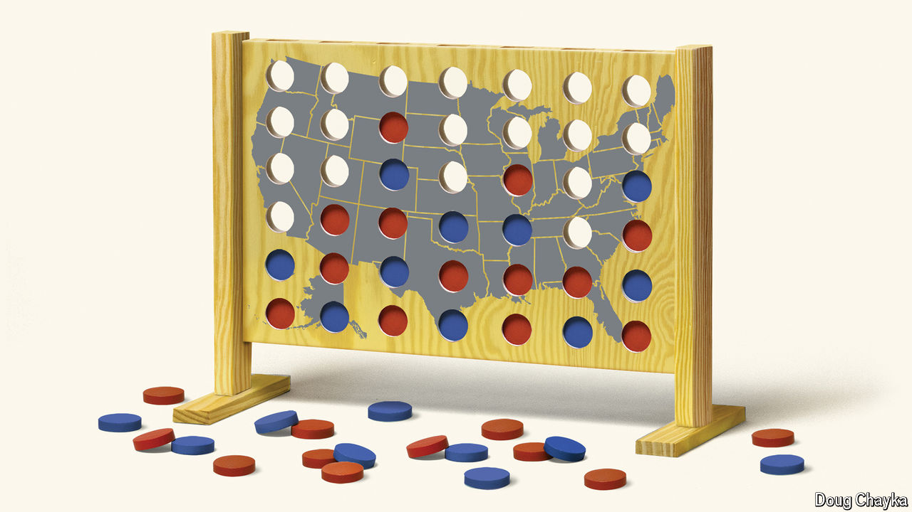

###### Shrinking coattails

# Who will control the next Congress? 

##### The new president is much less likely than usual to see allies take charge on Capitol Hill 

 

> Oct 10th 2024 

AMERICANS are fixated on whether Kamala Harris or Donald Trump will win the presidency on November 5th. But what the victor will actually be able to achieve depends in large part on which party controls Congress. Most new presidents have long coattails: not since George H.W. Bush was inaugurated in 1989 has one taken office without his party also controlling both chambers of Congress. But this year the race for congressional control looks as close as the presidential one, putting the normal outcome in doubt. If the election of 2024 is as much of a nail-biter as expected, the prospect of divided government—and with it the shelving of much of the new president’s agenda—looms large.

