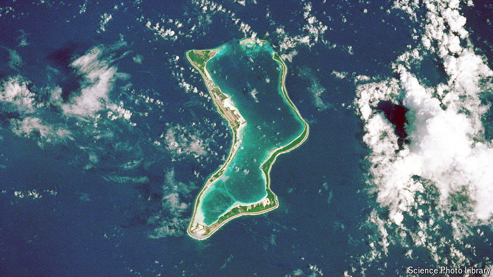

###### Oceans apart

# Britain has agreed to cede the Chagos Islands to Mauritius 

##### The Chagossians seem set to benefit less than China 

 

> Oct 4th 2024 

Few places in the world are quite so remote as the 60 or so islands that make up the Chagos Archipelago. Africa sits 3,000km to the west, Indonesia 3,000km to the east; the nearest large land mass is Sri Lanka, 1,700km to the north-east. More than 50 types of shark live in its pristine reefs. But the archipelago’s main resident is much more lethal: a military base on Diego Garcia, the largest island, leased to America by Britain since the 1970s. 

