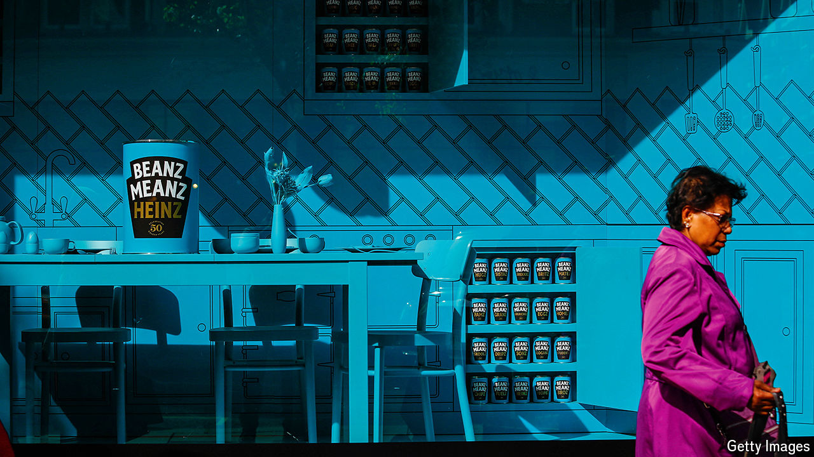

###### The pulses quicken

# Britain’s obsession with baked beans 

##### Health trends and gourmet beans are driving demand for other varieties 

 

> Oct 10th 2024 

WHEN Henry J. Heinz lugged five cases of tinned baked-bean samples to Fortnum &amp; Mason, a luxury department store in London, in 1886, he cannot have imagined the impact he would have on British diets. Back then the American dish of haricot beans cooked with tomato sauce and pork (the meat was later dropped during wartime rationing) was a delicacy. 

