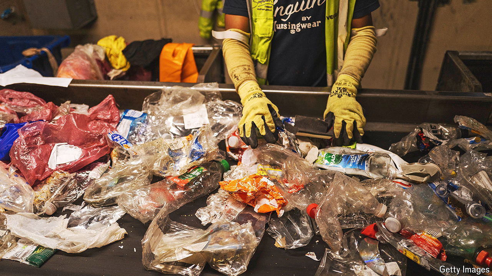

###### Modern life is rubbish

# The biography of a British recycling bag 

##### Do you really have to wash yogurt pots before throwing them away? 

 

> Oct 10th 2024 

Modern life offers many troubling questions. Is AI conscious? How do you stimulate economic growth? And do you really have to take that funny bit of paper at the bottom of the salmon packet out when you put it in the recycling? Also: do you have to wash your yogurt pots before recycling them? And is any of this stuff actually reused anyway? AI and growth are rather tricky. But the answers to the micro-worries are: no, no and yes, definitely. 

